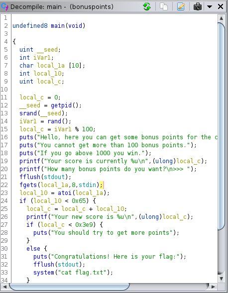

# Bonus Point

En testant des valeurs qui posaient problème directement, on pouvait trouver facilement la solution. 

En décompilant avec ghidra, on voit directement le problème:

On teste si l'entrée est inférieur à 0x65 soit <= 101. Ainsi l'entrée peut être le plus négatif qu'il soit et donc on a un Integer Overflow ! 