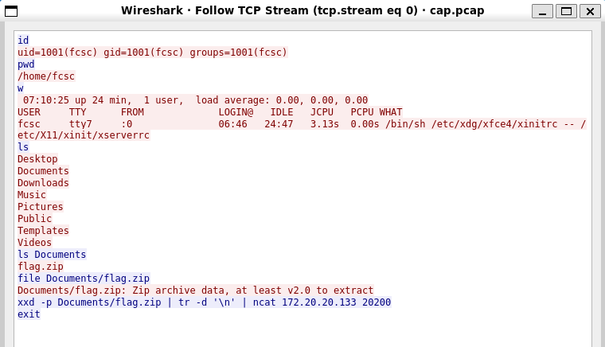
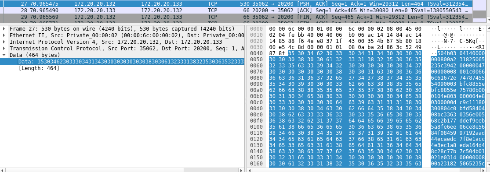
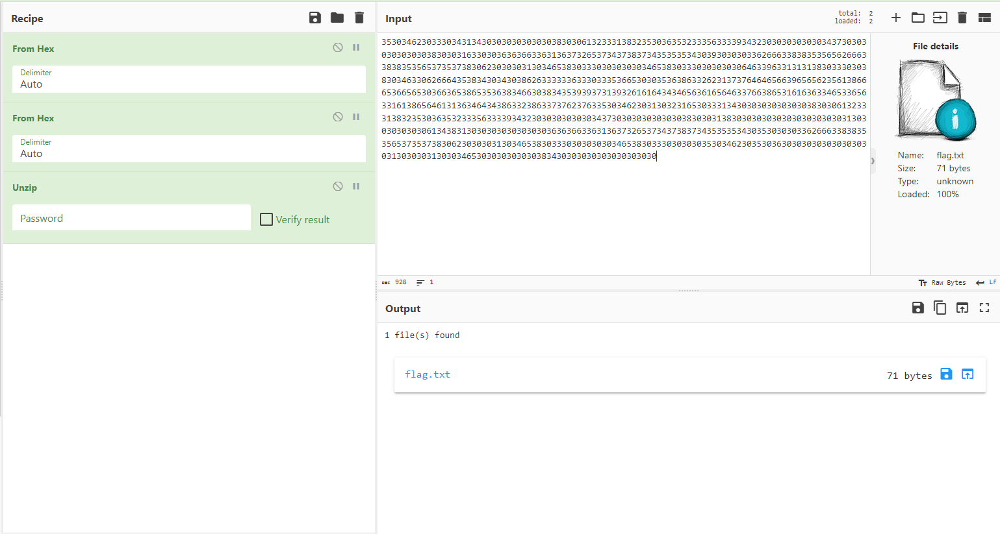

# Cap ou pcap

On outre le .pcap avec Wireshark. On remarque que ce sont principalement des échanges TCP. On va ainsi suivre le TCP stream avec Wireshark et on obtient : 

On va chercher ainsi des échanges sur le port 20200 et c'est ce qu'on voit ici : 

On copie les données sur cyberchef et on décode avec cyberchef. Attention, n'oublions pas que le fichier envoyé est un zip ! 

